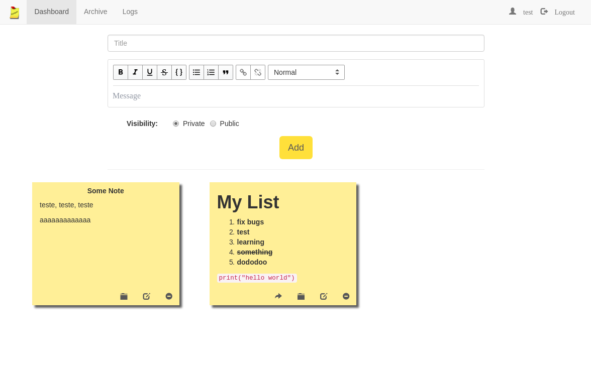

# Keeper                                                                                                    
                                                                                                             
 
                                                                                                             
 My clone of [Google Keep](https://keep.google.com) in NodeJS and ReactJS.
                                                                                                   
 ### Features

 - Note creating, deleting, updating
 - Note sharing
 - Note archiving
 - Activity log
                                                                                                             
 ### Requirements
                                                                                                             
 1. NodeJS
 2. MongoDB
                                                                                                             
 ### Next Steps
            
 * Make beautiful UI
 * ~~Add search box~~
 * Update shared notes
 * Update activity log
 * Add pagination
                                                                                                             
 ### License
                                                                                                             
 This project is licensed under the MIT License - see the [LICENSE](LICENSE) file for details
